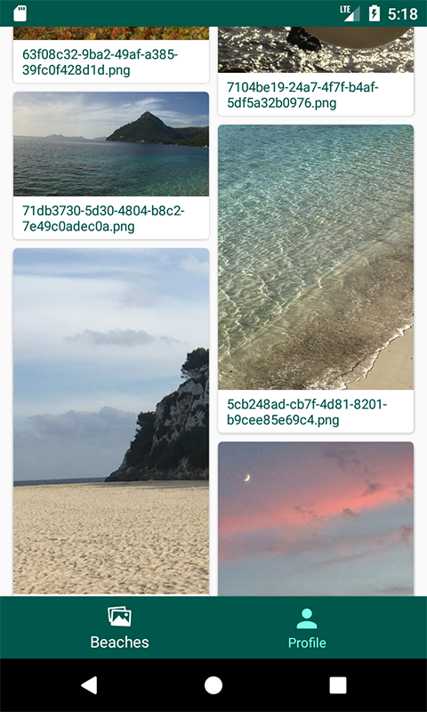
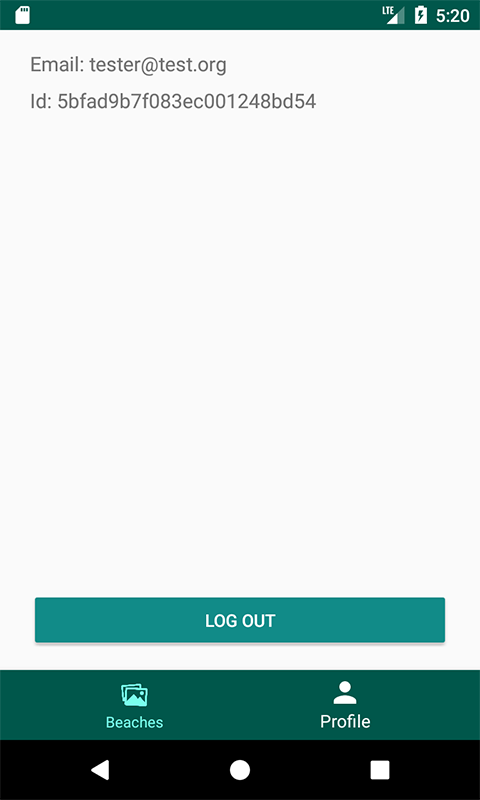

# HeyBeach

Android take home Test from Lab1886

## Feature Priority List
1. The user should see a list of images fetched from the HeyBeach API. (Initially just display the first page from the api) - DONE
2. A user should be able to register/login/logout inside the app. - DONE
3. Ensure the design interface is responsive and functional on mobile, desktop and/or tablets. -DONE
4. Include the image title with each image. -DONE
5. Implement some sort of infinite scrolling (Get all the images using the paginated api). -DONE
6. Implement some sort of image caching. -DONE (Only memory caching)
7. The image grid can be flexible, respecting the images aspect ratio (non-fixed size grid, check the wireframe, eg. Pinterest style)  - DONE (very similar to the Pineterest app.)

## Implementation Details

The application architecture is MVVM using Architecture Components.
Paging is done with the [Paging Library](https://developer.android.com/topic/libraries/architecture/paging/) from the Architecture Components.
It allows to unit test every layer and keep view logic and business logic independent.
For async working the app relies solely on Kotlin coroutines.
No 3rd party libraries were used, except for [Mockito](https://github.com/mockito/mockito) to mock dependencies in unit tests.

## Known issues and possible improvements

* All network requests fail through mobile data. The app works well on WI-FI connection.
* Disk caching can be added in ImageLoader

## Screenshots

